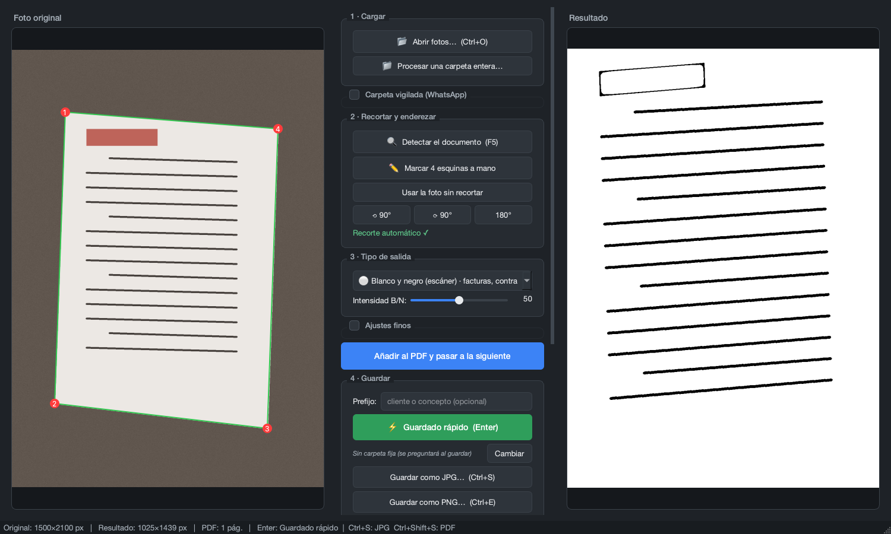

# Escáner de Fotos

Aplicación de escritorio para Windows que convierte fotos de documentos hechas con el móvil en imágenes tipo escáner: recortadas, enderezadas y con el texto perfectamente legible.

**Sin IA. Solo OpenCV puro.** Rápido, ligero, sin dependencias raras.

---

## Captura de pantalla



---

## Características

| Función | Descripción |
|---|---|
| 🔍 Detección automática | 6 estrategias (bordes por brillo y por **color**, umbral adaptativo, segmentación frente al fondo, HSV, Otsu); se elige el mejor candidato por puntuación. Funciona también con documentos de color, no solo papel blanco |
| 🧺 Cola en cadena | Suelta una tanda de fotos: se procesan una a una con miniaturas; ajustas y «Añadir al PDF y siguiente» salta sola a la próxima |
| ✏️ Selección manual | Clic en las 4 esquinas; clic derecho / Escape para deshacer |
| 🔄 Rotar | 90° / 180° / 270° por si el móvil guardó la foto torcida |
| ⚪ B/N nítido | Estilo CamScanner: máscara de tinta Sauvola + contraste adaptativo; texto suave y completo, fondo blanco puro |
| ⬛ B/N puro tinta | Binario de 1 bit con limpieza de motas inteligente; PDFs de decenas de KB (CCITT G4) |
| 🎨 Color limpio | Equilibra el blanco con Simplest Color Balance (IPOL 2011) + CLAHE suave; corrige la luz del DNI sin quemar ni virar el color |
| 📷 Color original | Solo recorte, sin retocar color |
| 🎚️ Ajustes finos | Brillo, contraste y nitidez con sliders en tiempo real |
| 📲 Carpeta vigilada | Las fotos que lleguen a una carpeta (p. ej. descargas de WhatsApp) entran solas a la cola |
| 🏷️ Prefijo | Nombre de archivo con cliente/concepto: `Perez_2026-06-10_14-33-12.jpg` |
| 🪪 DNI 2 en 1 | Las dos caras del DNI en una sola hoja A4 del PDF |
| 💾 JPG | Calidad 95% |
| 🖼️ PNG | Sin pérdida de calidad |
| 📄 PDF | Página única o multipágina; los B/N se incrustan a 1 bit (CCITT G4): ocupan decenas de KB |
| ↕️ Drag & drop | Arrastra una o varias fotos directamente sobre la ventana |
| 📱 HEIC | Abre fotos de iPhone (HEIC/HEIF) |

---

## Instalación rápida (primera vez)

1. **Asegúrate de tener Python 3.11 o superior:**
   Descárgalo desde [python.org](https://www.python.org/downloads/) y al instalar marca **"Add Python to PATH"**.

2. **Doble clic en `instalar.bat`**
   Instala automáticamente PySide6, OpenCV, NumPy y Pillow. Solo hay que hacerlo una vez.

3. **Doble clic en `EscanerFotos.bat`**
   Se abre el programa.

---

## Uso diario

Doble clic en `EscanerFotos.bat`.

### Flujo típico para una factura o contrato

1. **📂 Abrir imagen** (o arrastra la foto sobre la ventana) → `Ctrl+O`
2. **🔍 Detectar automáticamente** → `F5`
   - Si falla → **✏️ Marcar 4 esquinas a mano** (clic en cada esquina, clic derecho para deshacer)
   - Si el papel ya llena toda la foto → **↺ Usar sin recortar**
3. **Tipo de salida:** B/N nítido para documentos, Color limpio para DNI
4. **Ajustes** (opcionales): brillo, contraste, nitidez
5. **Guardar:** JPG (`Ctrl+S`), PNG (`Ctrl+E`) o PDF (`Ctrl+Shift+S`)

### Tanda de fotos de WhatsApp (cola en cadena)

1. Selecciona las fotos en la carpeta de descargas y **arrástralas todas a la vez** sobre la ventana (o ábrelas con `Ctrl+O`).
2. Se carga la primera y el resto aparece como **miniaturas en «Cola de fotos»**.
3. Recorta/ajusta la actual y pulsa **«Añadir al PDF y pasar a la siguiente»**: la próxima foto se carga sola.
4. Repite hasta la última y pulsa **Exportar el PDF**.
   - **Saltar esta** descarta la foto actual sin añadirla. Puedes **arrastrar las miniaturas** para reordenar la cola.

### PDF con varias páginas

1. Procesa cada página y pulsa **➕ Añadir** para ir añadiéndolas a la lista del PDF.
2. Cuando tengas todas, pulsa **Exportar el PDF**.

### DNI: las dos caras en una sola hoja

1. Procesa la cara delantera y pulsa **➕ Añadir**.
2. Procesa la trasera y pulsa **➕ Añadir**.
3. Pulsa **🪪 Unir 2 en 1 hoja (DNI)**: las dos páginas se convierten en una
   sola hoja A4 con la cara delantera arriba y la trasera abajo, como al
   fotocopiar un DNI. Después **📄 Exportar PDF** como siempre.

### Carpeta vigilada (WhatsApp)

En **Más opciones → Vigilar una carpeta** elige la carpeta donde guardas las
fotos que te llegan (p. ej. la de descargas de WhatsApp) y actívala: cada foto
nueva entra sola a la cola de trabajo, sin arrastrar nada.

---

## Atajos de teclado

| Atajo | Acción |
|---|---|
| `Ctrl+O` | Abrir imagen |
| `F5` | Detectar automáticamente |
| `Ctrl+Z` | Deshacer último punto (modo manual) |
| `Escape` | Cancelar modo manual |
| `Ctrl+R` | Resetear ajustes de brillo/contraste/nitidez |
| `Ctrl+S` | Guardar como JPG |
| `Ctrl+E` | Guardar como PNG |
| `Ctrl+Shift+S` | Guardar como PDF |

---

## Generar un .exe para distribuir

Ejecuta `crear_exe.bat`. Tarda 3-7 minutos y genera `dist\EscanerFotos.exe`, un ejecutable único (~150-200 MB) que funciona en cualquier Windows sin instalar nada.

---

## Tecnología

- **Python 3.11+**
- **PySide6** — interfaz gráfica (Qt 6)
- **OpenCV 4** — procesado de imagen
- **NumPy** — operaciones numéricas
- **Pillow** — exportar a PDF y PNG

Probado en Windows 10 y 11.

---

## Estructura del proyecto

```
EscanerFotos/
├── EscanerFotos/
│   ├── escaner_fotos.py      ← Interfaz gráfica (ventana, botones, acciones)
│   ├── estilo.py             ← Tema visual: paleta y hoja de estilos (QSS)
│   ├── recursos/             ← Icono de la app (y su generador en Pillow)
│   ├── imagen.py             ← Procesado de imagen (OpenCV/PIL puro, sin Qt)
│   ├── cola.py               ← Lógica pura de la cola de fotos
│   ├── actualizador.py       ← Capa Qt del auto-actualizador
│   ├── actualizador_core.py  ← Lógica pura del actualizador (testeable)
│   ├── version.py            ← Número de versión (única fuente de verdad)
│   ├── instalar.bat          ← Instalación inicial (una sola vez)
│   ├── EscanerFotos.bat      ← Lanzador diario
│   └── crear_exe.bat         ← Generar .exe para distribuir
├── tests/                    ← Tests automáticos (pytest)
├── instalador.iss            ← Instalador Inno Setup
└── .github/workflows/        ← CI: tests + instalador en cada tag
```

---

## Tests

```bash
pip install -r requirements.txt pytest
python -m pytest
```

Corren también en GitHub Actions antes de compilar cada instalador: si un
test falla, no se publica la release.

---

## Contribuir / seguir desarrollando

El código está dividido en bloques claros:

1. **`imagen.py`** (`detectar_documento`, `filtro_*`, `componer_dni`, etc.) — lógica pura, sin GUI.
2. **`LienzoImagen`** — widget QLabel con drag&drop y selección de puntos.
3. **`VentanaPrincipal`** — interfaz gráfica, botones y acciones.

Ideas para futuras mejoras:
- OCR con Tesseract (texto seleccionable en el PDF)
- Detección automática de orientación del texto
- Guardar perfiles de ajustes por tipo de documento

---

## Licencia

Uso personal. Generado con asistencia de [Claude](https://claude.ai).
